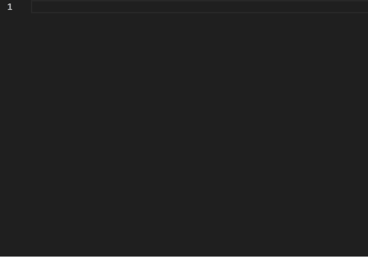

# Unicon Helper

This extension provides supports for Union Programming Language using:
- Language Server Protocol (LSP)
- Language Server Index Format (LSIF)
- Code Snippets

LSIF support and code snippets are baked into the extension itself. LSP requires running
Unicon Language Server which is shipped with Unicon sources.
See LSP Requirements below.

To use code snippets, see example below:

You can tab through each option in order like this:

Brought to you by:
- Mark Stowell
- Max Streeter
- Nathan Shapiro
- Jafar Al-Gharaibeh

## LSP Requirement

- download and build the latest source of Unicon
- install or add unicon/bin to your system path
